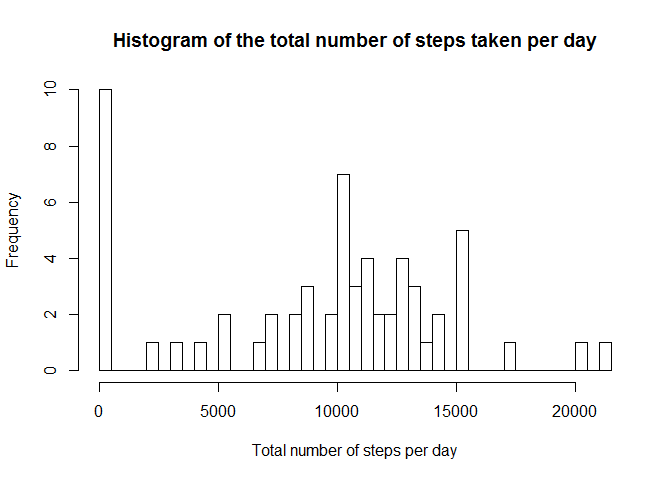
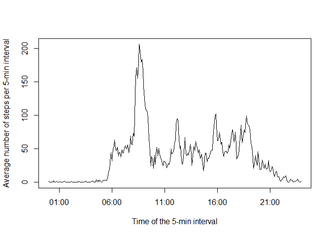
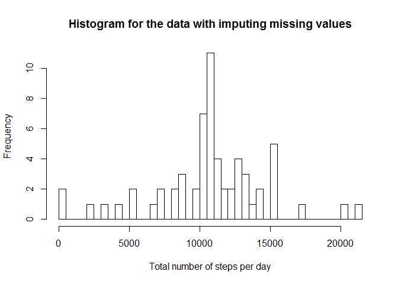
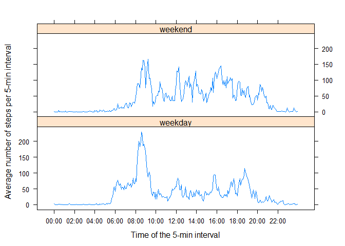

# Reproducible Research: Peer Assessment 1


## Loading and preprocessing the data

```r
data <- read.csv(unz("activity.zip" , "activity.csv"))
data <- transform(date=as.Date(date), interval=sprintf("%04d",interval),data)
```


## What is mean total number of steps taken per day?

Histogram of the total number of steps taken each day:


```r
stepsDay <- tapply(data$steps,data$date,sum,na.rm = TRUE,simplify = TRUE)
hist (stepsDay,xlab="Total number of steps per day", main="Histogram of the total number of steps taken per day",breaks=50)
```

 

The mean and the median of the total number of steps taken per day:

```r
mean(stepsDay)
```

```
## [1] 9354.23
```

```r
median(stepsDay)
```

```
## [1] 10395
```
## What is the average daily activity pattern?

We show how the average (across all days) number of steps taken in the 5-minute interval depends on the time of the day.


```r
stepsInt <- tapply(data$steps,data$interval,mean,na.rm = TRUE,simplify = TRUE)
plot(strptime(names(stepsInt),"%H%M"),stepsInt,type="l",xlab="Time of the 5-min interval", ylab="Average number of steps per 5-min interval")
```

 

The 5-minute interval that contains the maximum number of steps on average across all the days in the dataset is at 08:35. The maximum value is 206.1698113. 

```r
which.max(stepsInt)
```

```
## 0835 
##  104
```

```r
stepsInt[which.max(stepsInt)]
```

```
##     0835 
## 206.1698
```

## Imputing missing values

The total number of missing values in the dataset (i.e. the total number of rows with NAs) is 2304.


```r
summary(data)
```

```
##      steps             date              interval        
##  Min.   :  0.00   Min.   :2012-10-01   Length:17568      
##  1st Qu.:  0.00   1st Qu.:2012-10-16   Class :character  
##  Median :  0.00   Median :2012-10-31   Mode  :character  
##  Mean   : 37.38   Mean   :2012-10-31                     
##  3rd Qu.: 12.00   3rd Qu.:2012-11-15                     
##  Max.   :806.00   Max.   :2012-11-30                     
##  NA's   :2304
```

The missing value for the number of steps in an interval is replaced with the average (across all days) number of steps taken in that 5-minute interval.


```r
dataImp <- data
stepsNa <- is.na(data$steps)
dataImp$steps[stepsNa]<-stepsInt[data$interval[stepsNa]]
```

Histogram of the total number of steps taken each day for the data-set with the imputed missing values:


```r
stepsImpDay <- tapply(dataImp$steps,dataImp$date,sum,simplify = TRUE)
hist (stepsImpDay,xlab="Total number of steps per day", main="Histogram for the data with imputing missing values",breaks=50)
```

 

The mean and the median of the total number of steps taken per day:


```r
mean(stepsImpDay)
```

```
## [1] 10766.19
```

```r
median(stepsImpDay)
```

```
## [1] 10766.19
```

These values are larger than the values found in the first part of the assignment.
We see that the impact of imputing missing data on the estimates of the total daily number of steps is the increase of the estimated values compared with the analysis where the missing values are ignored. Also, there are much less number of days for which the value is $0$, and the distribution is more symmetric. 


## Are there differences in activity patterns between weekdays and weekends?

We create a new factor variable `dayWeek` in the dataset with two levels - "weekday" and "weekend" indicating whether a given date is a weekday or weekend day.


```r
weekdays<-weekdays(data$date)
weekend<-weekdays=="Samstag"|weekdays=="Sonntag"
dataImp$dayWeek<-factor(weekend,levels=c(FALSE,TRUE),labels=c("weekday","weekend"))
```

We show how the average number of steps taken in the 5-minute interval, averaged across all weekday days or weekend days, depends on the time of the day.


```r
stepsIntDay <- tapply(dataImp$steps,list(dataImp$interval,dataImp$dayWeek),mean,simplify=TRUE)
stepsIntWeekend<-data.frame(interval=strptime(rownames(stepsIntDay),"%H%M"), steps=stepsIntDay[,"weekend"] , day="weekend")
stepsIntWeekday<-data.frame(interval=strptime(rownames(stepsIntDay),"%H%M"), steps=stepsIntDay[,"weekday"] , day="weekday")
rownames(stepsIntWeekend)<-NULL;rownames(stepsIntWeekday)<-NULL
stepsIntDayDF<-rbind(stepsIntWeekday,stepsIntWeekend)

library(lattice)
int<-stepsIntDayDF$interval[seq.int(1,24*12,24)]
xyplot(steps~interval|day,type="l",data=stepsIntDayDF, layout = c(1, 2), scales=list(x=list(at= int,labels=format(int, "%H:%M"))),ylab="Average number of steps per 5-min interval",xlab="Time of the 5-min interval")
```

 

